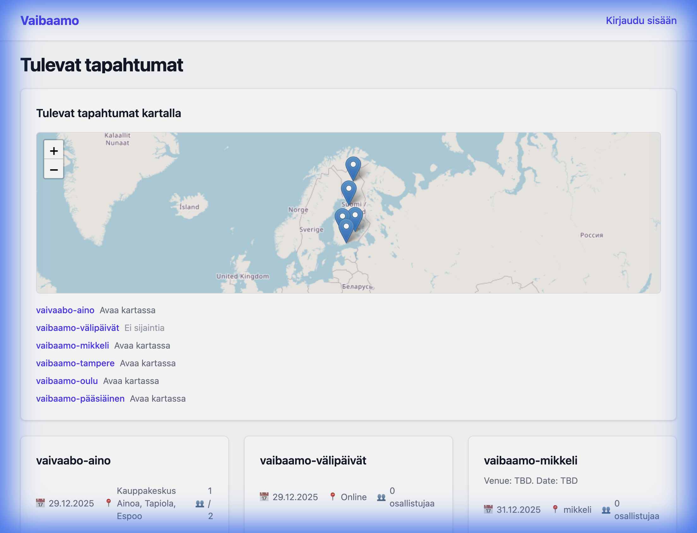

# 🗓️ Vaibaamo Calendar

Vaibaamo Calendar is a high-performance, modern event management application built with **React 19**, **Vite**, and **Supabase**. It features cutting-edge authentication methods like **Passkeys (WebAuthn)**, robust event synchronization, and an interactive spatial experience called the **Konami Journey**.



## 🚀 Key Features

### 🔐 Next-Gen Authentication
- **Passkeys (WebAuthn)**: Passwordless security using biometric or hardware keys.
- **Google OAuth**: Seamless login with automatic email synchronization to user profiles.
- **Role-Based Access**: Granular permissions for Admins, Creators, and Participants.

### 📅 Event Management
- **Full CRUD**: Create, edit, and delete events with rich descriptions and metadata.
- **Registration**: Real-time participant tracking and status management.
- **Admin Dashboard**: Specialized views for event creators and administrators to see participant details (including emails).

### 📍 Interactive Spatial Features
- **Leaflet Maps**: Integrated maps showing precise locations for all upcoming events.
- **Konami Journey**: A unique easter egg experience that generates dynamic routes to events with premium car animations.

### ⚙️ Deep Supabase Integration
- **Edge Functions**: Secure custom logic for WebAuthn and complex automations.
- **RLS (Row Level Security)**: Production-grade data isolation at the database level.
- **Real-time Sync**: User profiles stay synchronized with authentication metadata.

## 🛠️ Technology Stack

- **Frontend**: [React 19](https://react.dev), [Vite](https://vitejs.dev), [Tailwind CSS 4](https://tailwindcss.com), [React Router 7](https://reactrouter.com)
- **Backend/DB**: [Supabase](https://supabase.com) (PostgreSQL, Edge Functions, Auth, Storage)
- **Testing**: [Playwright](https://playwright.dev) (E2E), [Vitest](https://vitest.dev) (Unit)
- **Maps**: [Leaflet](https://leafletjs.com)

## 🏁 Getting Started

### Prerequisites
- Node.js (Latest LTS)
- Supabase Project

### Installation
1. Clone the repository
2. Install dependencies:
   ```bash
   npm install
   ```
3. Set up environment variables in `.env.local`:
   ```bash
   VITE_SUPABASE_URL=your_project_url
   VITE_SUPABASE_ANON_KEY=your_anon_key
   ```
4. Run the development server:
   ```bash
   npm run dev
   ```

## 🧪 Testing

Run unit tests:
```bash
npm test
```

Run E2E integration tests:
```bash
npm run test:integration
```

---
Built with ❤️ by the Vaibaamo Team.
