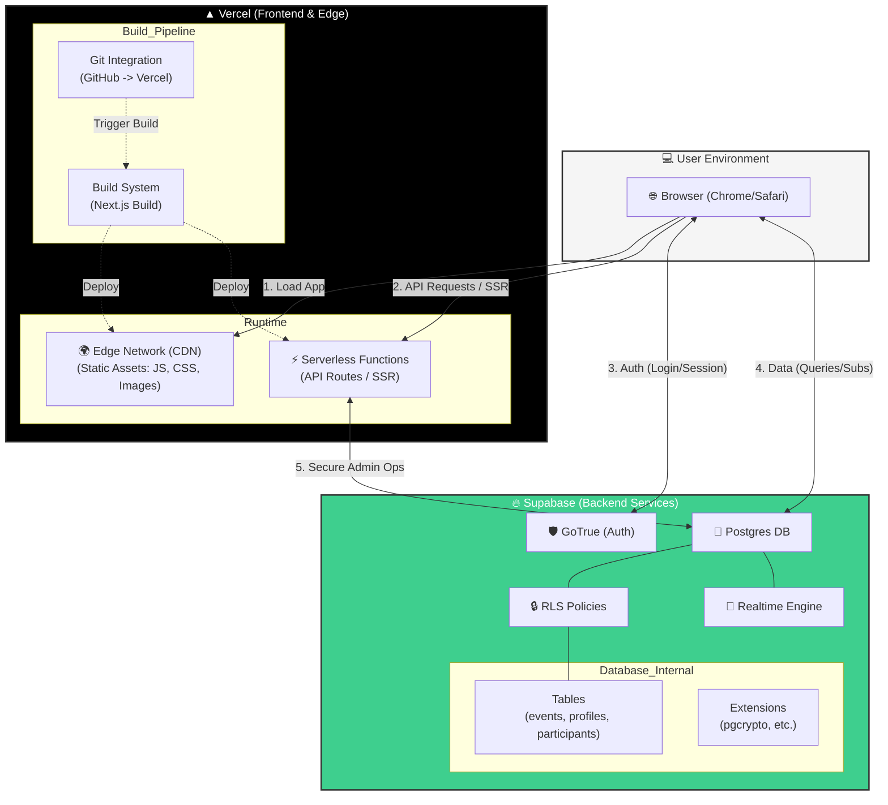

# Vaibaamo Calendar Deployment Architecture

This diagram illustrates the specific deployment flow for the **Vaibaamo Calendar** project, highlighting the integration between the **Vercel** frontend hosting and the **Supabase** backend services.

## Component Roles in Vaibaamo

1.  **Browser (Client):**
    *   Runs the React/Next.js client-side application.
    *   Maintains the active user session.
    *   Talks *directly* to Supabase for most data fetching (`supabase.from('events').select()`).

2.  **Vercel (The Host):**
    *   **CDN:** Serves the actual website files (HTML, JS bundles) instantly to users.
    *   **Serverless Functions (Next.js):** Handles capabilities like Server-Side Rendering (SSR) for SEO-optimized pages or specific API routes that need to happen *before* the page hits the browser.
    *   **Preview Deployments:** Automatically builds and deploys a unique URL for every Git branch/PR.

3.  **Supabase (The Backend):**
    *   **Postgres:** The single source of truth for all data (`events`, `profiles`).
    *   **Auth:** Handles the complex security of logging users in.
    *   **RLS (Row Level Security):** Acts as the "Firewall" inside the database. It allows the Browser to query the database directly *securely*, by checking "Does this user ID own this row?" for every single request.

---

## Deep Dive: Why "Browser Directly to Database"?

It feels wrong at first because for 20 years we built web apps like this:
`Browser` ➔ `API Server (Java/Python/Node)` ➔ `Database`

The **API Server** was the *only* thing allowed to talk to the DB. It held the admin password and checked permissions ("Is User A allowed to see this?").

### The Supabase Model (Backend-as-a-Service)

Supabase moves that "Permission Check" layer **into the Database itself**.
`Browser` ➔ `Supabase (PostgREST + RLS)` ➔ `Data`

**1. Why skip the Vercel API Server?**
*   **Latency:** Every hop adds time. Going `Browser -> Vercel -> Supabase -> Vercel -> Browser` is slower than `Browser -> Supabase -> Browser`.
*   **Cost & Scale:** If you route everything through Vercel Functions, you pay for the execution time of those functions just to forward a JSON packet. Supabase is optimized to serve thousands of concurrent data requests efficiently.
*   **Productivity:** You don't have to write (and test and maintain) an API endpoint for every single CRUD action. You just ask for the data you need.

**2. How is it Secure? (The "Magic" of RLS)**
Normally, if you gave a browser SQL access, a user could run `DROP TABLE events`.
But Supabase uses **Row Level Security (RLS)**:
*   You confirm the user's identity with the JWT.
*   You write a Policy in SQL: `CREATE POLICY "My Events" ON events USING (auth.uid() = creator_id);`
*   When the browser asks specifically for `SELECT * FROM events`, the database **automatically filters** the results. The query literally *cannot* see rows that don't match the policy.

### Request Authorization Flow

1.  **Login:** User triggers `supabase.auth.signInWithOAuth()`. Supabase Auth returns a **JWT** (JSON Web Token).
2.  **Storage:** The browser stores this token (e.g., in LocalStorage or Cookies).
3.  **Data Request:**
    *   The browser sends: `GET /events` + Header `Authorization: Bearer <JWT>`.
    *   Supabase checks the JWT signature.
    *   Supabase extracts the User ID (`auth.uid()`).
    *   Postgres executes the RLS policy using that ID.
    *   If allowed, data is returned.

---

## Question: Can we assume a "Supabase-Only" Architecture?

**Short Answer:** Not easily for a modern React App.

**Why?**
*   **Missing "Frontend Hosting":** Supabase provides backend services (DB, Auth, API, Functions), but it does **not** have a dedicated global CDN product for hosting your HTML/CSS/JS files like Vercel or Netlify does.
*   **The Gap:** You need a server to send the initial `index.html` file to the user's browser.

**When DO you use Vercel API routes?**
*   **Secrets:** When you need to use a secret key (Stripe, OpenAI) that you cannot expose to the browser.
*   **SSR:** To render HTML on the server for better SEO.

### Can Supabase Edge Functions replace Vercel APIs?

**YES.**

If your Vercel API route is just doing logic (e.g., "Take payment token, call Stripe, save to DB"), you can move that 100% to a Supabase Edge Function.

**The Comparison:**

| Feature | Vercel Serverless Function | Supabase Edge Function |
| :--- | :--- | :--- |
| **Runtime** | Node.js (Standard) | Deno (V8, Web Standards) |
| **Latency** | Good (Cold starts vary) | Excellent (Global distribution) |
| **Pricing Model** | **Complex (Fluid Compute):** Request + Duration + Memory + CPU. | **Simple:** Per Invocation ($2 / million). |
| **Cost** | ~$0.60/1M reqs (Pro) + Compute Time. | $2.00/1M invocations (Pro). |
| **Free Tier** | 100 GB-hours / 1M requests. | 500,000 invocations. |
| **Use Case** | General Backend logic | Webhooks, Lightweight APIs |

**Cost Nuance:**
*   **Vercel** looks cheaper per request ($0.60 vs $2.00), BUT you also pay for how long the function runs (CPU/Memory). If your function waits for a slow database or 3rd party API, Vercel costs go up.
*   **Supabase** charges per start, regardless of duration (within limits).
*   **Verdict:** For high-volume, simple logic, Supabase is very predictable. For long-running complex Node.js tasks, Vercel might be more familiar but harder to predict cost.

**The "Hybrid" Winner:**
Most teams use **Vercel** for the *Frontend* (Hosting + SSR) and **Supabase** for the *State* (DB + Auth).
For "Backend Logic," you can choose either. Supabase Edge Functions are often faster for DB-heavy logic because they share the same ecosystem.

---

## Observability: Seeing the Traffic

Since requests go to different places, you need to look in different places to debug.

### 1. The Browser (Network Tab)
*   **What you see:** *Everything* the client sends.
*   **Best for:** Debugging "Why is this request failing?" immediately.
*   **Look for:**
    *   Requests to `your-project.supabase.co` (Data & Auth).
    *   Requests to `your-app.vercel.app` (HTML, JS, API Routes).

### 2. Vercel Logs (The Frontend Host)
*   **Where:** Vercel Dashboard -> Project -> Logs.
*   **What you see:**
    *   `GET /` (Rendering the Home Page).
    *   `GET /api/...` (API Routes).
    *   `console.log()` output from your Server Components or API Routes.
*   **Blind Spot:** Vercel does **NOT** see traffic that goes directly from Browser -> Supabase.

### 3. Supabase Logs (The Backend)
*   **Where:** Supabase Dashboard -> Project -> Logs -> API Gateway (PostgREST).
*   **What you see:**
    *   Every database query sent by the browser.
    *   Example: `GET /rest/v1/events?select=*` | 200 OK | 150ms.
    *   Auth requests: `POST /auth/v1/token` (Login).
*   **Why use it:** To check if RLS policies are blocking valid data or to find slow queries.
